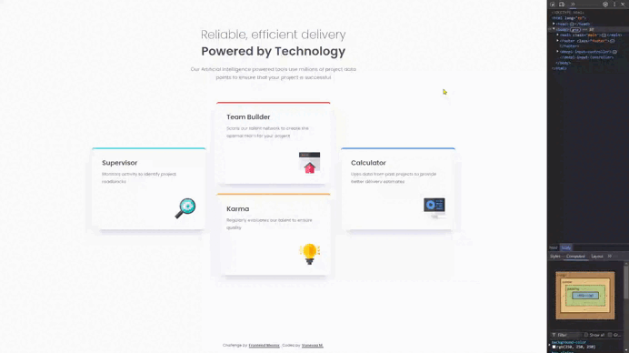

# Frontend Mentor - Four card feature section solution

This is a solution to the [Four card feature section challenge on Frontend Mentor](https://www.frontendmentor.io/challenges/four-card-feature-section-weK1eFYK). Frontend Mentor challenges help you improve your coding skills by building realistic projects. 

## Table of contents

🔳 [The challenge](#the-challenge-muscle)

🔳 [Screenshot](#screenshots-camera)

🔳 [Links](#links-link)

🔳 [Built with](#built-with-hammer_and_pick)

🔳 [Author](#author-beginner)

## The challenge :muscle:

Users should be able to:

🎯 View the optimal layout for the site depending on their device's screen size

## Screenshots :camera:

## Links :link:

[Live site URL here](https://mendezpvi.github.io/fem-four-card-feature/) 👈

<!-- [Solution in Frontend Mentor here](https://your-solution-url.com) 👈 -->

## Built with :hammer_and_pick:

📌 Mobile-first workflow

📌 Semantic HTML5 markup

📌 CSS custom properties

📌 CSS Grid

## Author :beginner:

✨ Frontend Mentor - [@mendezpvi](https://www.frontendmentor.io/profile/mendezpvi)

✨ X-Twitter - [@mendezpvi](https://x.com/mendezpvi)
